# ComfyUI Layer Style Advance

从[ComfyUI Layer Style](https://github.com/chflame163/ComfyUI_LayerStyle) 剥离出来的节点，主要是一些对依赖包要求较为复杂的节点。


## 工作流用示例
在workflow目录下有json格式的工作流示例文件，示范了如何在ComfyUI中使用这些节点。


## 安装方法
(以ComfyUI官方便携包和秋叶整合包为例，其他ComfyUI环境请修改依赖环境目录)

### 安装插件
* 推荐使用 ComfyUI Manager 安装。
* 或者在CompyUI插件目录(例如“CompyUI\custom_nodes\”)中打开cmd窗口，键入    
```
git clone https://github.com/chflame163/ComfyUI_LayerStyle_Advance.git
```
     
* 或者下载解压zip文件，将得到的文件夹复制到 ```ComfyUI\custom_nodes\```。   

### 安装依赖包

* 官方便携包请双击运行插件目录下的```install_requirements.bat```，秋叶整合包请双击运行插件目录下的```install_requirements_aki.bat```，然后等待安装完成。

* 或者在资源管理器```ComfyUI\custom_nodes\ComfyUI_LayerStyle_Advance``` 插件目录位置打开cmd窗口，  

&emsp;&emsp;官方便携包输入以下命令：

```
..\..\..\python_embeded\python.exe -s -m pip install .\whl\docopt-0.6.2-py2.py3-none-any.whl
..\..\..\python_embeded\python.exe -s -m pip install .\whl\hydra_core-1.3.2-py3-none-any.whl
..\..\..\python_embeded\python.exe -s -m pip install -r requirements.txt
.\repair_dependency.bat
```
&emsp;&emsp;秋叶整合包输入以下命令：

```
..\..\python\python.exe -s -m pip install .\whl\docopt-0.6.2-py2.py3-none-any.whl
..\..\python\python.exe -s -m pip install .\whl\hydra_core-1.3.2-py3-none-any.whl
..\..\python\python.exe -s -m pip install -r requirements.txt
.\repair_dependency.bat
```
* 重新打开ComfyUI。

### 下载模型
国内用户请从[百度网盘](https://pan.baidu.com/s/1T_uXMX3OKIWOJLPuLijrgA?pwd=1yye), 海外用户请从[huggingface](https://huggingface.co/chflame163/ComfyUI_LayerStyle/tree/main), 
下载全部模型文件并复制到```ComfyUI\models```文件夹。这个链接提供了本插件需要的所有的模型文件。
或者按各个节点的说明下载模型文件。    
以Ultra命名的节点使用vitmatte模型，请下载[vitmatte模型](https://huggingface.co/hustvl/vitmatte-small-composition-1k/tree/main)到```ComfyUI/models/vitmatte```文件夹，上面的下载链接也包括了这个模型。

## 常见问题
如果节点不能正常加载，或者使用中出现错误，请在ComfyUI终端窗口查看报错信息。以下是常见的错误及解决方法。

### Warning: xxxx.ini not found, use default xxxx..
这个警告信息是找不到ini文件的提示，不影响使用。如果不想看到这些警告，请修改插件目录下所有的 ```*.ini.example``` 文件名为```*.ini```。

### ModuleNotFoundError: No module named 'psd_tools'
这个错误是```psd_tools```没有正确安装。    

解决方法：
* 关闭ComfyUI，在插件目录下打开终端窗口，执行以下命令:
```../../../python_embeded/python.exe -s -m pip install psd_tools```
如果安装psd_tool中出现```ModuleNotFoundError: No module named 'docopt'```错误，请下载[docopt的whl](https://www.piwheels.org/project/docopt/)手动安装。在终端执行以下命令:
```../../../python_embeded/python.exe -s -m pip install path/docopt-0.6.2-py2.py3-none-any.whl``` path为whl文件的路径名。

### Cannot import name 'guidedFilter' from 'cv2.ximgproc'
这个错误是```opencv-contrib-python```没有正确安装，或者安装后又安装了其他opencv包导致。    

### NameError: name 'guidedFilter' is not defined
问题原因同上。

### Cannot import name 'VitMatteImageProcessor' from 'transformers' 
这个错误是由于```transformers``` 版本过低造成的

### insightface 加载缓慢
这是由于```protobuf``` 版本过低造成的。

#### 以上3个依赖包的问题，请双击运行插件目录下的```repair_dependency.bat```(官方便携包)或者```repair_dependency_aki.bat```(秋叶整合包)自动修复。 

### onnxruntime::python::CreateExecutionProviderInstance CUDA_PATH is set but CUDA wasn't able to be loaded. Please install the correct version of CUDA and cuDNN as mentioned in the GPU requirements page 
解决方法：
请重新安装```onnxruntime```依赖包

###  Error loading model xxx: We couldn't connect to huggingface.co ...
请检查网络环境。如果在中国不能正常访问huggingface.co，请尝试修改huggingface_hub包强制使用hf_mirror镜像。
* 在```huggingface_hub```包的目录(通常在虚拟环境内的```Lib/site-packages/huggingface_hub```)中找到```constants.py```,
在```import os```之后增加一行
```
os.environ['HF_ENDPOINT'] = 'https://hf-mirror.com'
```

### ValueError: Trimap did not contain foreground values (xxxx...)
这个错误是由于使用PyMatting方法处理遮罩边缘时，遮罩面积过大或者过小引起的。     

解决方法：
* 请调整参数，改变遮罩有效面积。或者换用其他的方法处理边缘。

### Requests.exceptions.ProxyError: HTTPSConnectionPool(xxxx...)
出现这个错误，请检查网络环境。

### UnboundLocalError: local variable 'clip_processor' referenced before assignment
### UnboundLocalError: local variable 'text_model' referenced before assignment
如果执行JoyCaption2节点时出现这个报错，同时已确定模型文件已放在正确的目录，请检查```transformers```依赖包版本至少在4.43.2以上。
如果```transformers```依赖包版本大于等于4.45.0, 并同时有报错信息：
```
Error loading models: De️️scriptors cannot be created directly.                                                                                           
If this call came from a _pb2.py file, your generated code is out of date and must be regenerated with protoc >= 3.19.0.                                
......
```
请尝试降级```protobuf```依赖包到3.20.3, 或者设置环境变量：```PROTOCOL_BUFFERS_PYTHON_IMPLEMENTATION=python```。

## 如何找到本节点组
* 在ComfyUI画布点击右键 - Add Node, 找到 "😺dzNodes"。    
    

* 或者在ComfyUI画布双击, 在搜索框输入"layer"。
    


## 更新说明
**如果本插件更新后出现依赖包错误，请双击运行插件目录下的```install_requirements.bat```(官方便携包)，或 ```install_requirements_aki.bat```(秋叶整合包) 重新安装依赖包。

* 添加 [DeepseekAPI V2](#DeepseekAPI V2) 节点，支持阿里云和火山引擎的deepseek api。
* 添加 [Collage](#Collage) 节点，将多张图片拼合为一张大图。
* 添加 [DeepSeekAPI](DeepSeekAPI) 节点，使用DeepSeek API进行文本推理。
* 添加 [SegmentAnythingUltraV3](#SegmentAnythingUltraV3) 和 [LoadSegmentAnythingModels](#LoadSegmentAnythingModels)节点， 在使用多个SAM节点时避免重复加载模型。
* 添加 [ZhipuGLM4](#ZhipuGLM4) 和 [ZhipuGLM4V](#ZhipuGLM4V)节点，使用智谱API进行文本和视觉推理。目前的智谱模型中，GLM-4-Flash和glm-4v-flash模型是免费的。
在[https://bigmodel.cn/usercenter/proj-mgmt/apikeys](https://bigmodel.cn/usercenter/proj-mgmt/apikeys)免费申请API Key，填入插件目录下的```api_key.ini```。
* 添加 [Gemini](#Gemini) 节点， 使用Gemini API进行文本或视觉推理。
* 添加 [ObjectDetectorGemini](#ObjectDetectorGemini) 节点， 使用Gemini API进行物体检测。
* 添加 [DrawBBOXMaskV2](#DrawBBOXMaskV2) 节点，可绘制圆角矩形遮罩。
* 添加 [SmolLM2](#SmolLM2), [SmolVLM](#SmolVLM), [LoadSmolLM2Model](#LoadSmolLM2Model) 和 [LoadSmolVLMModel](#LoadSmolVLMModel) 节点，使用smol轻量级本地模型进行文本推理和图片识别。
从[百度网盘](https://pan.baidu.com/s/1_jeNosYdDqqHkzpnSNGfDQ?pwd=to5b) 或 [huggingface](https://huggingface.co/chflame163/ComfyUI_LayerStyle/tree/main/ComfyUI/models/smol) 下载模型文件至```ComfyUI/models/smol```文件夹。
* Florence2 节点支持[gokaygokay/Florence-2-Flux-Large](https://huggingface.co/gokaygokay/Florence-2-Flux-Large) 和 [gokaygokay/Florence-2-Flux](https://huggingface.co/gokaygokay/Florence-2-Flux)模型。
从[百度网盘](https://pan.baidu.com/s/1wBwJZjgMUKt0zluLAetMOQ?pwd=d6fb) 或者 [huggingface](https://huggingface.co/chflame163/ComfyUI_LayerStyle/tree/main/ComfyUI/models/florence2) 下载Florence-2-Flux-Large 和 Florence-2-Flux 两个目录，并放到```ComfyUI\models\florence2``文件夹。  
* 从requirements.txt 中废弃 [ObjectDetector YOLOWorld](#ObjectDetectorYOLOWorld) 节点所需的依赖。如需使用此节点，请手动安装依赖包。
* 从ComfyUI Layer Style 剥离部分节点至本仓库。


## 节点说明


### <a id="table1">Collage</a>
将输入的批量图片随机拼合为一张大图。

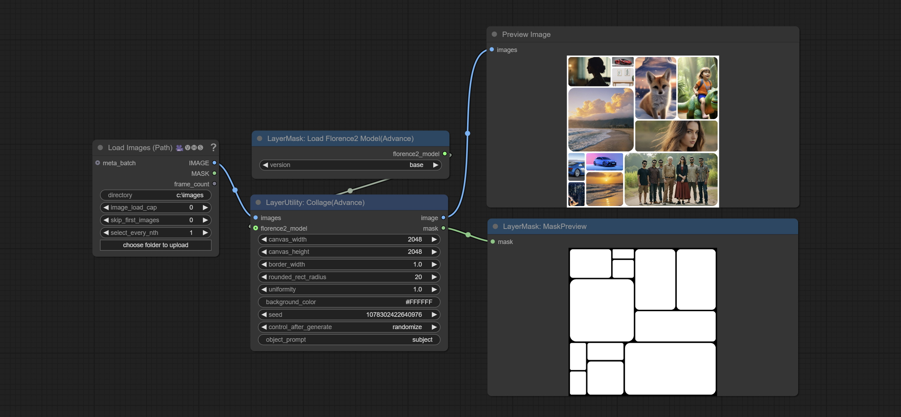    

节点选项说明:   
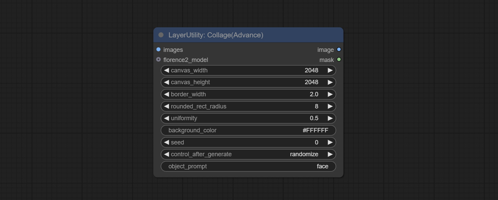    

* images: 图片输入。
* florence2_model: 可选输入，用于物体识别裁切。
* canvas_width: 输出图片的宽度。
* canvas_height: 输出图片的高度。
* border_width: 边框宽度。
* rounded_rect_radius: 边框圆角半径。
* uniformity: 图片拼合大小的随机性。取值范围为0-1，值越大，大小随机性越大。
* background_color: 背景色。
* seed: 随机种子。
* control_after_generate: 设置每次执行时种子值的变化。
* object_prompt: 当接入florence2_model时，此处填写物体识别的提示词。


### <a id="table1">QWenImage2Prompt</a>
根据图片反推提示词。这个节点是[ComfyUI_VLM_nodes](https://github.com/gokayfem/ComfyUI_VLM_nodes)中的```UForm-Gen2 Qwen Node```节点的重新封装，感谢原作者。
从[huggingface](https://huggingface.co/unum-cloud/uform-gen2-qwen-500m)或者[百度网盘](https://pan.baidu.com/s/1oRkUoOKWaxGod_XTJ8NiTA?pwd=d5d2)下载模型到```ComfyUI/models/LLavacheckpoints/files_for_uform_gen2_qwen```文件夹。

    

节点选项说明:   
* question: 对UForm-Gen-QWen模型的提示词。

### <a id="table1">LlamaVision</a>
使用Llama 3.2 vision 模型进行本地推理。可以用于生成提示词。本节点部分代码来自[ComfyUI-PixtralLlamaMolmoVision](https://github.com/SeanScripts/ComfyUI-PixtralLlamaMolmoVision)，感谢原作者。
运行这个节点需要transformers升级到4.45.0以上。
请从 [百度网盘](https://pan.baidu.com/s/18oHnTrkNMiwKLMcUVrfFjA?pwd=4g81) 或 [huggingface/SeanScripts](https://huggingface.co/SeanScripts/Llama-3.2-11B-Vision-Instruct-nf4/tree/main)下载整个文件夹，并复制到ComfyUI/models/LLM。

    

节点选项说明:   
    

* image: 图片输入。
* model: 目前仅有"Llama-3.2-11B-Vision-Instruct-nf4"这一个模型可用。
* system_prompt: LLM模型的系统提示词。
* user_prompt: LLM模型的用户提示词。
* max_new_tokens: LLM的max_new_tokens参数。
* do_sample: LLM的do_sample参数。
* top-p: LLM的top_p参数。
* top_k: LLM的top_k参数。
* stop_strings: 截止字符串。
* seed: 随机种子。
* control_after_generate: 种子变化选项。
* include_prompt_in_output: 输出是否包含提示词。
* cache_model: 是否缓存模型。

### <a id="table1">JoyCaption2</a>
使用JoyCaption-alpha-two模型生成提示词。本节点是 https://huggingface.co/John6666/joy-caption-alpha-two-cli-mod 在ComfyUI中的实现，感谢原作者。
请从 [百度网盘](https://pan.baidu.com/s/1dOjbUEacUOhzFitAQ3uIeQ?pwd=4ypv) 以及 [百度网盘](https://pan.baidu.com/s/1mH1SuW45Dy6Wga7aws5siQ?pwd=w6h5) ， 
或者 [huggingface/Orenguteng](https://huggingface.co/Orenguteng/Llama-3.1-8B-Lexi-Uncensored-V2/tree/main) 以及 [huggingface/unsloth](https://huggingface.co/unsloth/Meta-Llama-3.1-8B-Instruct/tree/main) 下载整个文件夹，并复制到ComfyUI/models/LLM,
从 [百度网盘](https://pan.baidu.com/s/1pkVymOsDcXqL7IdQJ6lMVw?pwd=v8wp) 或者 [huggingface/google](https://huggingface.co/google/siglip-so400m-patch14-384/tree/main) 下载整个文件夹，并复制到ComfyUI/models/clip,
从 [百度网盘](https://pan.baidu.com/s/12TDwZAeI68hWT6MgRrrK7Q?pwd=d7dh) 或者 [huggingface/John6666](https://huggingface.co/John6666/joy-caption-alpha-two-cli-mod/tree/main)下载 ```cgrkzexw-599808``` 文件夹，并复制到ComfyUI/models/Joy_caption。
    

节点选项说明:   
    

* image: 图片输入。
* extra_options: extra_options参数输入。
* llm_model: 目前有 Orenguteng/Llama-3.1-8B-Lexi-Uncensored-V2 和 unsloth/Meta-Llama-3.1-8B-Instruct 两种LLM模型可选择。
* device: 模型加载设备。目前仅支持cuda。
* dtype: 模型加载精度，有nf4 和 bf16 两个选项。
* vlm_lora: 是否加载text_model。
* caption_type: caption类型选项, 包括"Descriptive"(正式语气描述), "Descriptive (Informal)"(非正式语气描述), "Training Prompt"(SD训练描述), "MidJourney"(MJ风格描述), "Booru tag list"(标签列表), "Booru-like tag list"(类标签列表), "Art Critic"(艺术评论), "Product Listing"(产品列表), "Social Media Post"(社交媒体风格)。
* caption_length: 描述长度。
* user_prompt: LLM模型的用户提示词。如果这里有内容将覆盖caption_type和extra_options的所有设置。
* max_new_tokens: LLM的max_new_tokens参数。
* do_sample: LLM的do_sample参数。
* top-p: LLM的top_p参数。
* temperature: LLM的temperature参数。
* cache_model: 是否缓存模型。

### <a id="table1">JoyCaption2Split</a>
JoyCaption2 的分离式节点，将模型加载与推理分离，使用多个JoyCaption2节点时可共用模型提高效率。

节点选项说明:   
    

* image: 图片输入。
* joy2_model: JoyCaption模型输入。
* extra_options: extra_options参数输入。
* caption_type: caption类型选项, 包括"Descriptive"(正式语气描述), "Descriptive (Informal)"(非正式语气描述), "Training Prompt"(SD训练描述), "MidJourney"(MJ风格描述), "Booru tag list"(标签列表), "Booru-like tag list"(类标签列表), "Art Critic"(艺术评论), "Product Listing"(产品列表), "Social Media Post"(社交媒体风格)。
* caption_length: 描述长度。
* user_prompt: LLM模型的用户提示词。如果这里有内容将覆盖caption_type和extra_options的所有设置。
* max_new_tokens: LLM的max_new_tokens参数。
* do_sample: LLM的do_sample参数。
* top-p: LLM的top_p参数。
* temperature: LLM的temperature参数。

### <a id="table1">LoadJoyCaption2Model</a>
JoyCaption2 的模型加载节点，与JoyCaption2Split配合使用。

节点选项说明:   
    

* llm_model: 目前有 Orenguteng/Llama-3.1-8B-Lexi-Uncensored-V2 和 unsloth/Meta-Llama-3.1-8B-Instruct 两种LLM模型可选择。
* device: 模型加载设备。目前仅支持cuda。
* dtype: 模型加载精度，有nf4 和 bf16 两个选项。
* vlm_lora: 是否加载text_model。


### <a id="table1">JoyCaption2ExtraOptions</a>
JoyCaption2的extra_options参数节点。 

节点选项说明:   
    

* refer_character_name: 如果图像中有人物/角色，必须将其称为{name}
* exclude_people_info: 不要包含有关无法更改的人物/角色的信息（例如种族、性别等），但仍包含可更改的属性（例如发型）。
* include_lighting: 包括照明信息。
* include_camera_angle: 包括摄影机角度信息。
* include_watermark: 包括是否有水印信息。
* include_JPEG_artifacts: 包括是否存在 JPEG 伪影信息。
* include_exif: 如果是照片，包含相机的信息以及光圈、快门速度、ISO等信息。
* exclude_sexual: 不要包含任何与性有关的内容，保持PG。
* exclude_image_resolution: 不要包含图像分辨率信息。
* include_aesthetic_quality: 包含图像美学（从低到非常高）信息。
* include_composition_style: 包括有关图像构图风格的信息，例如引导线、三分法或对称性。
* exclude_text: 不要包含任何文字信息。
* specify_depth_field: 包含景深以及背景模糊信息。
* specify_lighting_sources: 如果可以判别人造或自然光源，则包含在内。
* do_not_use_ambiguous_language: 不要使用任何含糊不清的言辞。
* include_nsfw: 包含NSFW或性暗示信息。
* only_describe_most_important_elements: 只描述最重要的元素。
* character_name: 如果选择了```refer_character_name```，则使用此处的名字。

### <a id="table1">PhiPrompt</a>
使用Micrisoft Phi 3.5文字及视觉模型进行本地推理。可以用于生成提示词，加工提示词或者反推图片的提示词。运行这个模型需要至少16GB的显存。
请从[百度网盘](https://pan.baidu.com/s/1BdTLdaeGC3trh1U3V-6XTA?pwd=29dh) 或者 [huggingface.co/microsoft/Phi-3.5-vision-instruct](https://huggingface.co/microsoft/Phi-3.5-vision-instruct/tree/main) 和 [huggingface.co/microsoft/Phi-3.5-mini-instruct](https://huggingface.co/microsoft/Phi-3.5-mini-instruct/tree/main) 下载全部模型文件并放到 ```ComfyUI\models\LLM``` 文件夹。
    

节点选项说明:   
    

* image: 可选输入。输入的图片将作为Phi-3.5-vision-instruct的输入。
* model: 可选择加载的Phi-3.5-vision-instruct模型，或者Phi-3.5-mini-instruct模型。默认值auto将根据是否有图片输入自动加载对应模型。
* device: 模型加载设备。支持cpu和cuda。
* dtype: 模型加载精度，有fp16、bf16和fp32三个选项。
* cache_model: 是否缓存模型。
* system_prompt: Phi-3.5-mini-instruct的系统提示词。
* user_prompt: LLM模型的用户提示词。
* do_sample: LLM的do_sample参数，默认为True。
* temperature: LLM的temperature参数，默认为0.5。
* max_new_tokens: LLM的max_new_tokens参数，默认为512。

### <a id="table1">Gemini</a>
使用Google Gemini API进行文字及视觉模型进行本地推理。可以用于生成提示词，加工提示词或者反推图片的提示词。
请在[Google AI Studio](https://makersuite.google.com/app/apikey)申请你的API key, 并将其填到```api_key.ini```, 这个文件位于插件根目录下, 默认名字是```api_key.ini.example```, 初次使用这个文件需将文件后缀改为.ini。用文本编辑软件打开，在```google_api_key=```后面填入你的API key并保存。
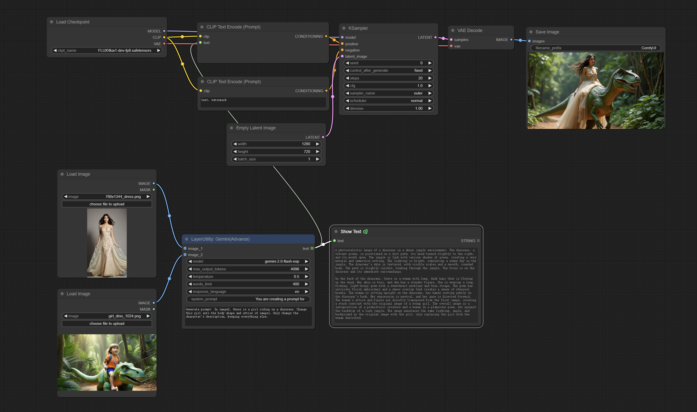    

节点选项说明:   
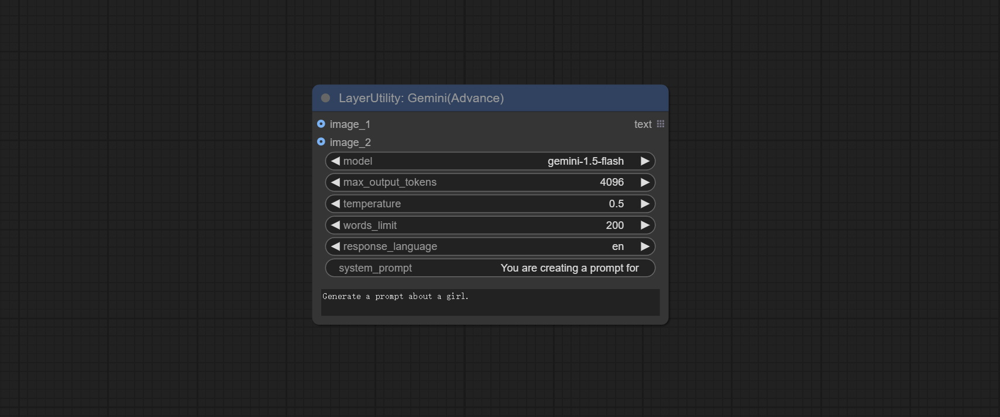    

* image_1: 可选输入。如果此处有图片输入，需在user_prompt中说明```image_1```的用途。
* image_2: 可选输入。如果此处有图片输入，需在user_prompt中说明```image_2```的用途。
* model: 选择Gemini模型。
* max_output_tokens: Gemini的max_output_tokens参数，默认为4096。
* temperature: Gemini的temperature参数，默认为0.5。
* words_limit: 回复字数限制，默认为200。
* response_language: 回复的语言。
* system_prompt: 系统提示词。
* user_prompt: 用户提示词。

### <a id="table1">DeepSeekAPI</a>
使用DeepSeek API进行文本推理，支持多节点上下文串联。        
在[https://platform.deepseek.com/api_keys](https://platform.deepseek.com/api_keys)申请API Key，并将其填到```api_key.ini```, 这个文件位于插件根目录下, 默认名字是```api_key.ini.example```, 初次使用这个文件需将文件后缀改为.ini。用文本编辑软件打开，在```deepseek_api_key=```后面填入你的API key并保存。
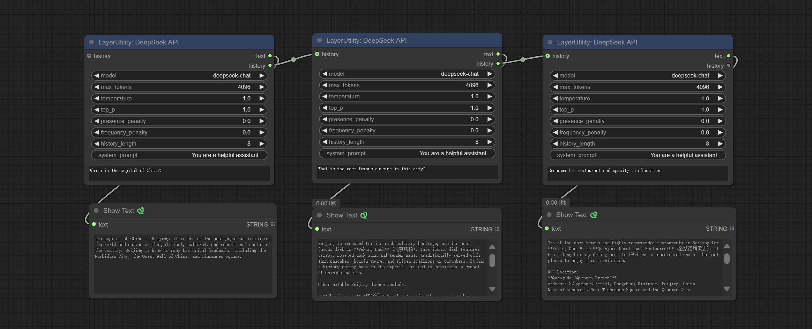    

节点选项说明:   
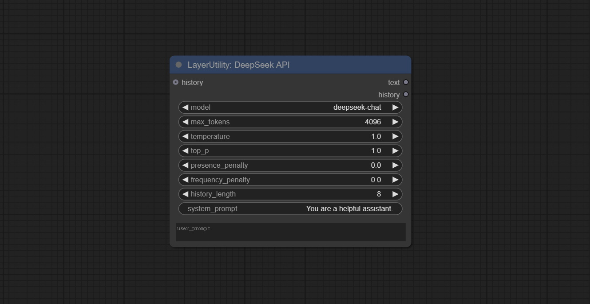    

* history: DeepSeekAPI节点的历史记录，可选输入。如果此处有输入，将使用历史记录作为上下文。
* model: 选择DeepSeek模型，目前仅有一个选项："deepseek-chat"即DeepSeek-V3模型。
* max_tokens: DeepSeek的max_tokens参数，默认为4096。
* temperature: DeepSeek的temperature参数，默认为1。
* top_p: DeepSeek的top_p参数，默认为1。
* presence_penalty: DeepSeek的presence_penalty参数，默认为0。
* frequency_penalty: DeepSeek的frequency_penalty参数，默认为0。
* history_length: 历史记录长度。超出该长度的记录将被截断。
* system_prompt: 系统提示词。
* user_prompt: 用户提示词。


输出:
* text: DeepSeek的输出。
* history: DeepSeek对话历史记录。

### <a id="table1">DeepSeekAPI V2</a>
在 [DeepSeekAPI](#DeepSeekAPI) 节点基础上增加支持阿里云和火山引擎的deepseek api，这两家中国云服务商将提供更稳定的api服务。    
    
* 在 [火山引擎](https://console.volcengine.com/ai/api/key/) 申请火山引擎api key, 有50万tokens免费额度，如果在申请时填入我的邀请码 ```27RVS1QN```，将额外获得375万R1模型免费tokens。     

* 在 [阿里云](https://bailian.console.aliyun.com/?apiKey=1#/api-key) 申请阿里云api key。    

* 将获得的api key填到```api_key.ini```的```volcengine_api_key``` 和 ```aliyun_api_key``` 字段。 这个文件位于插件根目录下，默认名字是```api_key.ini.example```，请编辑后将文件后缀改为.ini。
    
增加选项：   
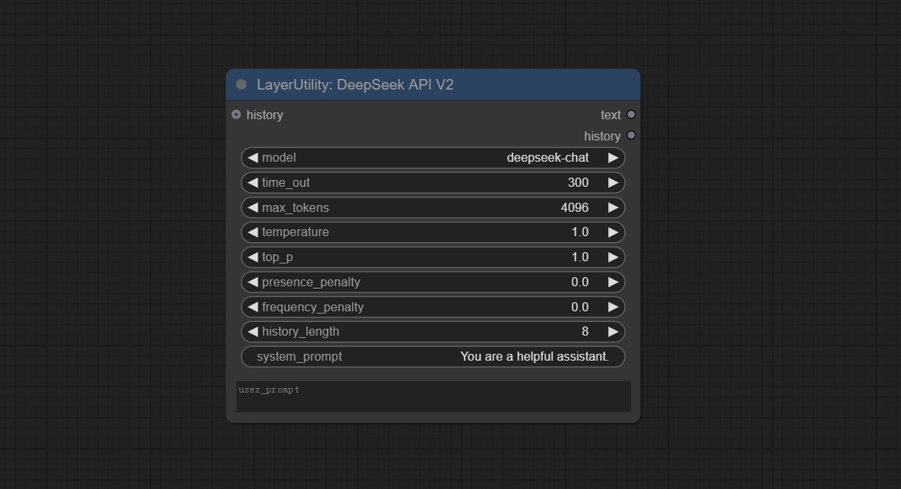

* time_out: 超时时间，默认为300秒。


### <a id="table1">ZhipuGLM4</a>
使用智谱API进行文本推理，支持多节点上下文串联。        
在[https://bigmodel.cn/usercenter/proj-mgmt/apikeys](https://bigmodel.cn/usercenter/proj-mgmt/apikeys)免费申请API Key，并将其填到```api_key.ini```, 这个文件位于插件根目录下, 默认名字是```api_key.ini.example```, 初次使用这个文件需将文件后缀改为.ini。用文本编辑软件打开，在```zhipu_api_key=```后面填入你的API key并保存。
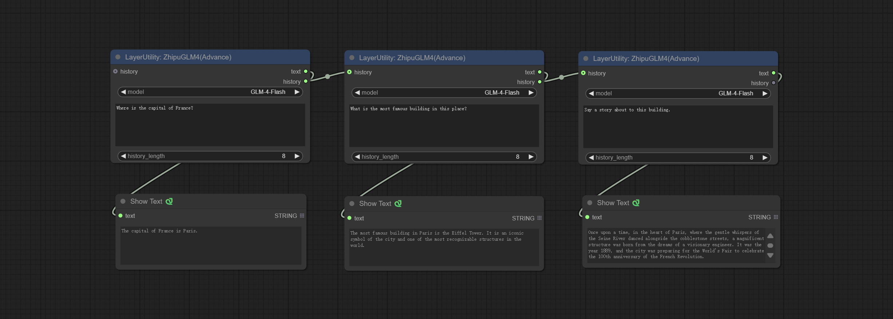    

节点选项说明:   
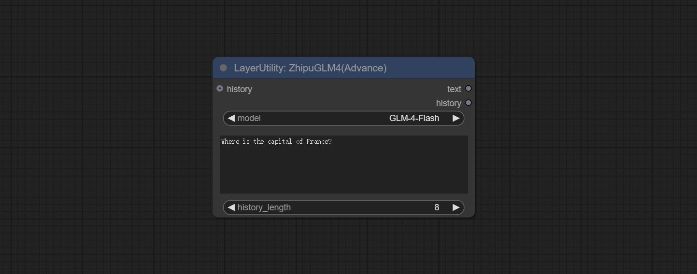    

* history: GLM4节点的历史记录，可选输入。如果此处有输入，将使用历史记录作为上下文。
* model: 选择GLM4模型。GLM-4-Flash为免费模型。
* user_prompt: 用户提示词。
* history_length: 历史记录长度。超出该长度的记录将被截断。

输出:
* text: GLM4的输出。
* history: GLM4对话历史记录。

### <a id="table1">ZhipuGLM4</a>
使用智谱API进行视觉推理。        
在[https://bigmodel.cn/usercenter/proj-mgmt/apikeys](https://bigmodel.cn/usercenter/proj-mgmt/apikeys)免费申请API Key，并将其填到```api_key.ini```, 这个文件位于插件根目录下, 默认名字是```api_key.ini.example```, 初次使用这个文件需将文件后缀改为.ini。用文本编辑软件打开，在```zhipu_api_key=```后面填入你的API key并保存。

节点选项说明:   
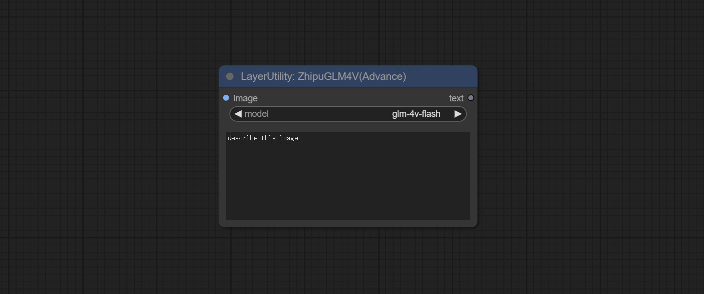    

* image: 输入的图片。
* model: 选择GLM4V模型。glm-4v-flash为免费模型。
* user_prompt: 用户提示词。

输出:
* text: GLM4V的输出。

### <a id="table1">SmolLM2</a>
使用 [SmolLM2](https://huggingface.co/HuggingFaceTB/SmolLM2-135M-Instruct) 轻量级文本模型进行本地推理。
从[百度网盘](https://pan.baidu.com/s/1_jeNosYdDqqHkzpnSNGfDQ?pwd=to5b) 或 [huggingface](https://huggingface.co/chflame163/ComfyUI_LayerStyle/tree/main/ComfyUI/models/smol) 找到 SmolLM2-135M-Instruct、SmolLM2-360M-Instruct、SmolLM2-1.7B-Instruct三个文件夹，至少下载其中之一，复制到 ```ComfyUI/models/smol```文件夹。

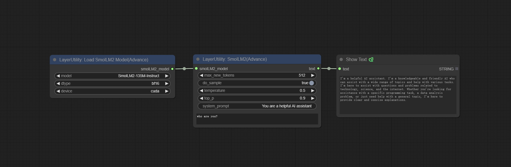    

节点选项说明:   
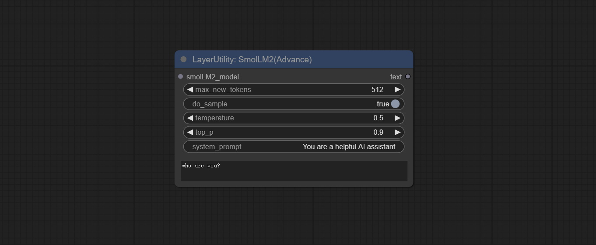    

* smolLM2_model: SmolLM2模型输入，从[LoadSmolLM2Model](#LoadSmolLM2Model) 节点加载。
* max_new_tokens: 最大tokens，默认为512。
* do_sample: do_sample参数，默认为True。
* temperature: temperature参数，默认为0.5。
* top-p: top_p参数，默认0.9。
* system_prompt: 系统提示词。
* user_prompt: 用户提示词。

### <a id="table1">LoadSmolLM2Model</a>
加载 SmolLM2 模型。

节点选项说明:   
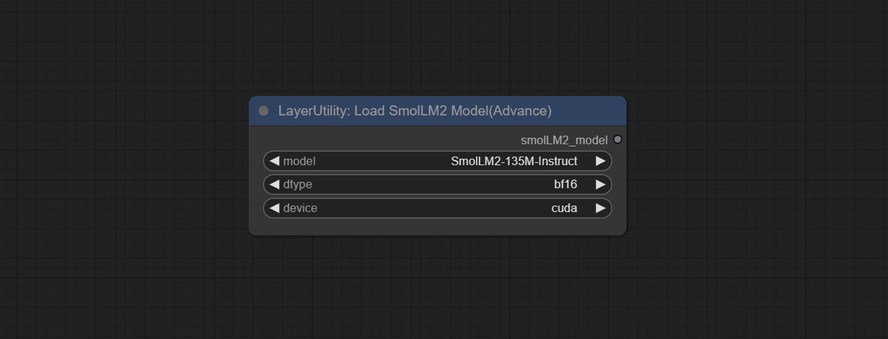    

* model: SmolLM2模型选择，有SmolLM2-135M-Instruct、SmolLM2-360M-Instruct、SmolLM2-1.7B-Instruct三个选项。
* dtype: 模型精度，有bf16和fp32两个选项。
* device: 模型加载设备，有cuda和cpu两个选项。

### <a id="table1">SmolVLM</a>
使用 [SmolVLM](https://huggingface.co/HuggingFaceTB/SmolVLM-Instruct) 轻量级视觉模型进行本地推理。
从[百度网盘](https://pan.baidu.com/s/1_jeNosYdDqqHkzpnSNGfDQ?pwd=to5b) 或 [huggingface](https://huggingface.co/chflame163/ComfyUI_LayerStyle/tree/main/ComfyUI/models/smol) 下载SmolVLM-Instruct文件夹，复制到 ```ComfyUI/models/smol```文件夹。

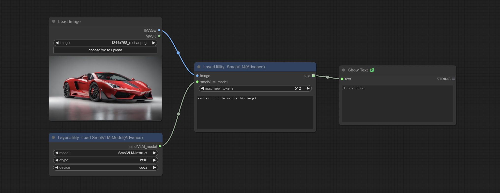    

节点选项说明:   
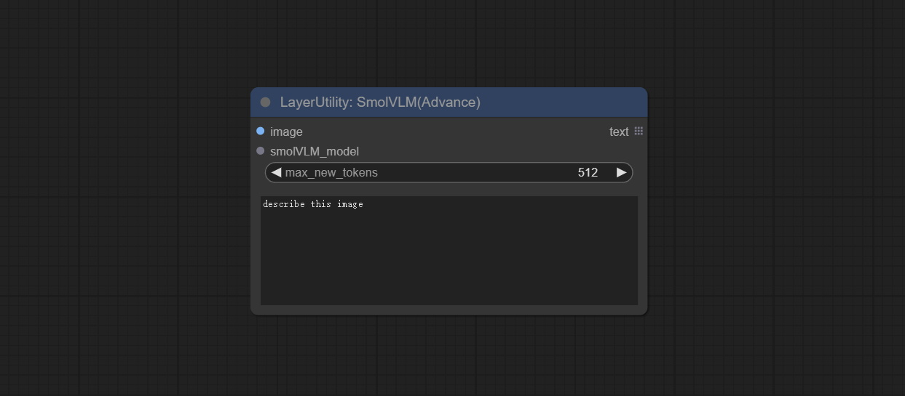    

* image: 图片输入，支持批量图片。
* smolVLM_model: SmolVLM模型输入，从[LoadSmolVLMModel](#LoadSmolVLMModel) 节点加载。
* max_new_tokens: 最大tokens，默认为512。
* user_prompt: 用户提示词。

### <a id="table1">LoadSmolVLMModel</a>
加载 SmolVLM 模型。

节点选项说明:   
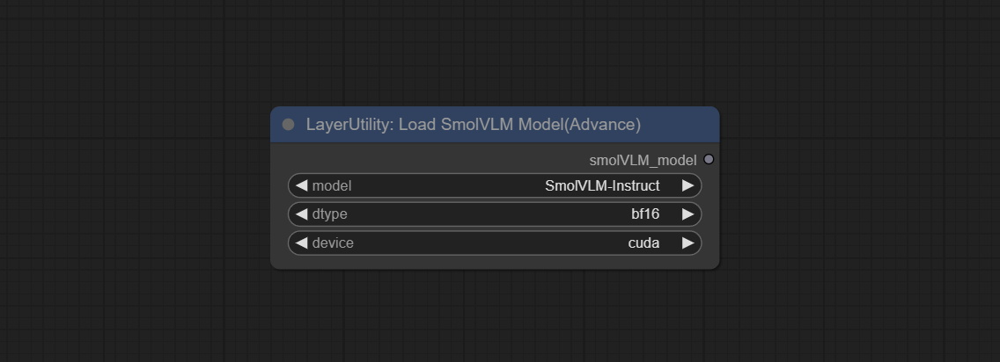    

* model: SmolVLM模型选择，目前仅有SmolVLM-Instruct这一个选择。
* dtype: 模型精度，有bf16和fp32两个选项。
* device: 模型加载设备，有cuda和cpu两个选项。


### <a id="table1">UserPromptGeneratorTxtImg</a>
用于生成SD文本到图片提示词的UserPrompt预设。

节点选项说明:   


* template: 提示词模板。目前仅有“SD txt2img prompt”可用。
* describe: 提示词描述。在这里输入简单的描述。
* limit_word: 输出的提示词最大长度限制。例如200即表示输出文本将被限制在200个词以内。

### <a id="table1">UserPromptGeneratorTxtImgWithReference</a>
用于参考输入的内容生成SD文本到图片提示词的UserPrompt预设。

节点选项说明:   


* reference_text: 参考文本输入。通常是图片的风格描述。
* template: 提示词模板。目前仅有“SD txt2img prompt”可用。
* describe: 提示词描述。在这里输入简单的描述。
* limit_word: 输出的提示词最大长度限制。例如200即表示输出文本将被限制在200个词以内。


### <a id="table1">UserPromptGeneratorReplaceWord</a>
用于将文本中的某个关键词替换为不同内容的UserPrompt预设。这不仅是简单的替换，还可以根据提示词上下文进行文字逻辑梳理以达到输出内容的合理性。

节点选项说明:   


* orig_prompt: 原始提示词输入。
* template: 提示词模板。目前仅有“prompt replace word”可用。
* exclude_word: 需要排除的关键词。
* replace_with_word: 替换exclude_word的关键词。

### <a id="table1">PromptTagger</a>
根据图片反推提示词，可以设置替换词。这个节点目前使用Google Gemini API作为后端服务，请确保网络环境可以正常使用Gemini。
请在[Google AI Studio](https://makersuite.google.com/app/apikey)申请你的API key, 并将其填到```api_key.ini```, 这个文件位于插件根目录下, 默认名字是```api_key.ini.example```, 初次使用这个文件需将文件后缀改为.ini。用文本编辑软件打开，在```google_api_key=```后面填入你的API key并保存。
    

节点选项说明:   
    

* api: 使用的Api。有"gemini-1.5-flash"和"google-gemini"两个选项。
* token_limit: 生成提示词的最大token限制。
* exclude_word: 需要排除的关键词。
* replace_with_word: 替换exclude_word的关键词。

### <a id="table1">PromptEmbellish</a>
输入简单的提示词，输出经过润色的提示词，支持输入图片作为参考，支持中文输入。这个节点目前使用Google Gemini API作为后端服务，请确保网络环境可以正常使用Gemini。
请在[Google AI Studio](https://makersuite.google.com/app/apikey)申请你的API key, 并将其填到```api_key.ini```, 这个文件位于插件根目录下, 默认名字是```api_key.ini.example```, 初次使用这个文件需将文件后缀改为.ini。用文本编辑软件打开，在```google_api_key=```后面填入你的API key并保存。
    

节点选项说明:   
    

* image: 可选项，输入图像作为提示词参考。
* api: 使用的Api。有"gemini-1.5-flash"和"google-gemini"两个选项。
* token_limit: 生成提示词的最大token限制。
* discribe: 在这里输入简单的描述。支持中文。

### <a id="table1">Florence2Image2Prompt</a>
使用florence2模型反推提示词。本节点部分的代码来自[yiwangsimple/florence_dw](https://github.com/yiwangsimple/florence_dw)，感谢原作者。
*首次使用时将自动下载模型，请在可以访问huggingface.co的网络环境下使用。您也可以从[百度网盘](https://pan.baidu.com/s/1hzw9-QiU1vB8pMbBgofZIA?pwd=mfl3)下载模型文件并复制到```ComfyUI/models/florence2```文件夹。

 

节点选项说明:

* florence2_model: Florence2模型输入。
* image: 图片输入。
* task: 选择florence2任务。
* text_input: florence2任务文本输入。
* max_new_tokens: 生成文本的最大token数量。
* num_beams: 生成文本的beam search数量。
* do_sample: 是否使用文本生成采样。
* fill_mask: 是否使用文本标记掩码填充。

### <a id="table1">GetColorTone</a>
从图片中获取主颜色或平均色。
    

节点选项说明:
    
* mode： 模式，有两种可选择，主颜色main_color和平均色average。

输出:
* RGB color in HEX: 使用16进制RGB字符串格式描述，例如 '#FA3D86'。
* HSV color in list: HSV颜色值，使用list格式描述。

### <a id="table1">GetColorToneV2</a>
GetColorTone的V2升级版。可以指定获取主体或背景的主色或平均色。


在GetColorTong基础上做了如下改变:
    
* color_of: 提供4个选项，mask, entire, background和subject, 分别表示选择遮罩区域，整个图片，背景，或主体的颜色。
* remove_background_method: 背景识别的方法, 有BiRefNet和RMBG V1.4两种可以选择。
* invert_mask: 是否反转遮罩。
* mask_grow: 遮罩扩张。对于subject, 更大的值使获得的颜色更接近主体中心的颜色。

输出:
* image: 纯色图片输出, 尺寸与输入的图片相同。
* mask: 遮罩输出。


### <a id="table1">ImageRewardFilter</a>
    
对批量图片评分并输出排名靠前的图片。这个节点使用了[ImageReward](https://github.com/THUDM/ImageReward)作为图片评分，感谢原作者。

    
节点选项说明:
* prompt: 可选输入。将prompt在此输入将作为依据判定其与图片的符合程度。
* output_nun: 输出的图片数量。此数值应小于图片批量。

输出：
* images: 按评分顺序从高到低输出的批量图片。
* obsolete_images: 淘汰的图片。同样按评分顺序从高到低输出。


### <a id="table1">LaMa</a>
    
根据图像遮罩擦除物体。本节点是对[IOPaint](https://www.iopaint.com)的封装，由 SOTA AI 模型提供支持， 感谢原作者。   
提供[LaMa](https://github.com/advimman/lama), [LDM](https://github.com/CompVis/latent-diffusion), [ZITS](https://github.com/DQiaole/ZITS_inpainting),[MAT](https://github.com/fenglinglwb/MAT),  [FcF](https://github.com/SHI-Labs/FcF-Inpainting), [Manga](https://github.com/msxie92/MangaInpainting) 模型以及 SPREAD 擦除方法。请查看链接了解各个模型的介绍。  
请下载模型文件 [lama models(百度网盘)](https://pan.baidu.com/s/1m7La2ELsSKaIFhQ57qg1XQ?pwd=jn10) 或者 [lama models(Google Drive)](https://drive.google.com/drive/folders/1Aq0a4sybb3SRxi7j1e1_ZbBRjaWDdP9e?usp=sharing), 将文件放到```ComfyUI/models/lama```

节点选项说明:
    
* lama_model: 选择模型或方法。
* device: 在正确安装torch和Nvidia CUDA驱动程序后，使用cuda将明显提高运行速度。
* invert_mask: 是否反转遮罩。
* grow: 遮罩扩张幅度。正值是向外扩张，负值是向内收缩。
* blur: 遮罩模糊幅度。


### <a id="table1">ImageAutoCrop</a>
    
自动抠图并按照遮罩裁切图片。可指定生成图片的背景颜色、长宽比和大小。这个节点是为生成训练模型的图片素材而设计的。  
*请参照 [SegmentAnythingUltra](#SegmentAnythingUltra) 和 [RemBgUltra](#RemBgUltra) 节点的模型安装方法安装模型。 


节点选项说明:
    
* background_color<sup>4</sup>: 背景颜色。
* aspect_ratio: 输出的宽高比。这里提供了常见的画幅比例， "custom"为自定义比例。
* proportional_width: 比例宽。如果aspect_ratio选项不是"custom"，此处设置将被忽略。
* proportional_height: 比例高。如果aspect_ratio选项不是"custom"，此处设置将被忽略。
* scale_by_longest_side: 允许按长边尺寸缩放。
* longest_side: scale_by_longest_side被设置为True时，此项将作为是图像长边的长度。
* detect: 探测方法，min_bounding_rect是最小外接矩形, max_inscribed_rect是最大内接矩形。
* border_reserve: 保留边框。在探测到的遮罩主体区域之外扩展裁切范围。
* ultra_detail_range: 遮罩边缘超精细处理范围，0为不处理，可以节省生成时间。
* matting_method: 生成遮罩的方法。有Segment Anything和 RMBG 1.4两种方法。RMBG 1.4运行速度更快。
* sam_model: 此处选择Segment Anything所使用的sam模型。
* grounding_dino_model: 此处选择Segment Anything所使用的grounding_dino模型。
* sam_threshold: Segment Anything的阈值。
* sam_prompt: Segment Anything的提示词。

输出:
cropped_image: 裁切并更换背景后的图像。
box_preview: 裁切位置预览。
cropped_mask: 裁切后的遮罩。

### <a id="table1">ImageAutoCropV2</a>

```ImageAutoCrop```的V2升级版，在之前基础上做了如下改变：  
    

* 增加```mask```可选输入。当有mask输入时，直接使用该输入跳过内置遮罩生成。
* 增加```fill_background```, 当此项设置为False时将不处理背景，并且超出画幅的部分不纳入输出范围。
* ```aspect_ratio```增加```original```(原始画面宽高比)选项。
* scale_by: 允许按长边、短边、宽度或高度指定尺寸缩放。
* scale_by_length: 这里的数值作为scale_by指定边的长度。

### <a id="table1">ImageAutoCropV3</a> 
自动裁切图片到指定的尺寸。可输入mask以保留遮罩指定的区域。这个节点是为生成训练模型的图片素材而设计的。  


节点选项说明:
   
* image: 输入的图像。
* mask: 可选输入遮罩。遮罩部分将在裁切长宽比例范围内得到保留。
* aspect_ratio: 输出的宽高比。这里提供了常见的画幅比例， "custom"为自定义比例， "original"为原始画面比例。
* proportional_width: 比例宽。如果aspect_ratio选项不是"custom"，此处设置将被忽略。
* proportional_height: 比例高。如果aspect_ratio选项不是"custom"，此处设置将被忽略。
* method: 缩放的采样方法，包括lanczos、bicubic、hamming、bilinear、box和nearest。
* scale_to_side: 允许按长边、短边、宽度、高度或总像素指定尺寸缩放。
* scale_to_length: 这里的数值作为scale_to_side指定边的长度, 或者总像素数量(kilo pixels)。
* round_to_multiple: 倍数取整。例如设置为8，宽和高将强制设置为8的倍数。

输出:
cropped_image: 裁切后的图像。
box_preview: 裁切位置预览。


### <a id="table1">SaveImagePlus</a>
    
增强版的保存图片节点。可自定义保存图片的目录，文件名增加时间戳，选择保存格式，设置图片压缩率，设置是否保存工作流，以及可选给图片添加隐形水印(以肉眼无法觉察的方式添加信息，使用配套的```ShowBlindWaterMark```节点可以解码水印)。可选择是否同时输出工作流的json文件。

节点选项说明:
    
* iamge: 输入的图片。
* custom_path<sup>*</sup>: 用户自定义目录，请按正确的格式输入目录名。如果为空则保存在ComfyUI默认的output目录。
* filename_prefix<sup>*</sup>:文件名前缀。。
* timestamp: 为文件名加上时间戳，可选择日期、时间到秒和时间到毫秒。
* format:图片保存格式。目前提供png和jpg两种。注意RGBA模式的图片仅支持png格式。
* quality:图片质量，数值范围10-100，数值越高，图片质量越好，文件的体积也对应增大。
* meta_data:是否保存元数据即工作流信息到png文件。如果不希望泄露工作流，请把这里设置为false。
* blind_watermark:这里输入的文字（不支持多语言）将被转换为二维码作为隐形水印保存，使用```ShowBlindWaterMark```节点可以解码水印。注意有水印的图片建议保存为png格式，质量较低的jpg格式将导致水印信息丢失。
* save_workflow_as_json: 是否同时输出工作流为json文件(输出的json与图片在同一目录)。
* preview: 预览开关。

<sup>*</sup>输入```%date```表示当前日期(YY-mm-dd)，```%time```表示当前时间(HH-MM-SS)。可以输入```/```表示子目录。例如```%date/name_%time``` 将输出图片到```YY-mm-dd```文件夹下，以```name_HH-MM-SS```为文件名前缀。


### <a id="table1">AddBlindWaterMark</a>
    
给图片添加隐形水印。以肉眼无法觉察的方式添加水印图片，使用```ShowBlindWaterMark```节点可以解码水印。

节点选项说明:
    
* iamge: 输入的图片。
* watermark_image: 水印图片。这里输入的图片将自动转为正方形的黑白图片作为水印。建议使用二维码作为水印。


### <a id="table1">ShowBlindWaterMark</a>
对```AddBlindWaterMark``` 和 ```SaveImagePlus``` 节点添加的隐形水印解码。
    


### <a id="table1">CreateQRCode</a>
生成一个正方形的二维码图片。

节点选项说明:  
    
* size: 生成图片的边长。
* border: 二维码四周边框的大小，数值越大，边框越宽。
* text: 这里输入二维码文字内容，不支持多语言。

### <a id="table1">DecodeQRCode</a>
解码二维码。

节点选项说明:  
    
* image: 输入二维码图片。
* pre_blur: 预模糊，对难以识别的二维码可以尝试调整此数值。

### <a id="table1">LoadPSD</a>
    
    
加载PSD格式文件，并导出图层。
注意这个节点需要安装psd_tools依赖包，如果安装psd_tool中出现```ModuleNotFoundError: No module named 'docopt'```错误，请下载[docopt的whl](https://www.piwheels.org/project/docopt/)手动安装。

节点选项说明:  
    
* image: 这里列出了```ComfyUI/input```下的*.psd文件，之前加载过的psd图片可以从这里选择。
* file_path: psd文件的完整路径以及文件名。
* include_hidden_layer: 是否包括隐藏图层。
* find_layer_by: 查找图层的方法，可选择按图层索引编号或者图层名称查找。图层组被作为一个图层对待。
* layer_index: 图层索引编号，0是最下面的图层，依次递增。如果include_hidden_layer设置为false，隐藏的图层不计入。设为-1则输出最上层的图层。
* layer_name: 图层名称。注意大小写和标点符号必须完全匹配。

输出:
flat_image: psd预览图。
layer_iamge: 查找的图层输出。
all_layers: 包含全部图层的批量图片。

### <a id="table1">SD3NegativeConditioning</a>
  
把SD3的Negative Conditioning 的4个节点封装为一个单独节点。

节点选项说明:  
    
* zero_out_start: 设置Negative ConditioningZeroOut的ConditioningSetTimestepRange start值, 此数值与Negative的ConditioningSetTimestepRange end值相同。


### <a id="table1">BenUltra</a>
是[PramaLLC/BEN](https://huggingface.co/PramaLLC/BEN) 项目在ComfyUI中的实现。感谢原作者。    
从 [huggingface](https://huggingface.co/chflame163/ComfyUI_LayerStyle/tree/main/ComfyUI/models/BEN) 或 [百度网盘](https://pan.baidu.com/s/17mdBxfBl_R97mtNHuiHsxQ?pwd=2jn3)下载全部文件并复制到 ```ComfyUI/models/BEN```文件夹。


节点选项说明：

* ben_model: Ben模型输入，有BEN_Base和BEN2_base两种模型可选。
* image: 图片输入。
* detail_method: 边缘处理方法。提供了VITMatte, VITMatte(local), PyMatting, GuidedFilter。如果首次使用VITMatte后模型已经下载，之后可以使用VITMatte(local)。
* detail_erode: 遮罩边缘向内侵蚀范围。数值越大，向内修复的范围越大。
* detail_dilate: 遮罩边缘向外扩张范围。数值越大，向外修复的范围越大。
* black_point: 边缘黑色采样阈值。
* white_point: 边缘白色采样阈值。
* process_detail: 此处设为False将跳过边缘处理以节省运行时间。
* max_megapixels: 设置vitmatte运算的最大尺寸。

### <a id="table1">LoadBenModel</a>
加载BEN模型。 


节点选项说明:  
  

* model: 选择模型。目前仅有Ben_Base 模型可选。


### <a id="table1">SegmentAnythingUltra</a>
对[ComfyUI Segment Anything](https://github.com/storyicon/comfyui_segment_anything)的改进，使遮罩有更具细节的边缘，感谢原作者。
*请参照ComfyUI Segment Anything的安装方法安装模型。如果已经正确安装了ComfyUI Segment Anything，可跳过此步骤。
* 从 [这里](https://huggingface.co/bert-base-uncased/tree/main) 下载 config.json，model.safetensors，tokenizer_config.json，tokenizer.json 和 vocab.txt 5个文件到 ```ComfyUI/models/bert-base-uncased```文件夹。
* 下载 [GroundingDINO_SwinT_OGC config file](https://huggingface.co/ShilongLiu/GroundingDINO/resolve/main/GroundingDINO_SwinT_OGC.cfg.py), [GroundingDINO_SwinT_OGC model](https://huggingface.co/ShilongLiu/GroundingDINO/resolve/main/groundingdino_swint_ogc.pth), 
[GroundingDINO_SwinB config file](https://huggingface.co/ShilongLiu/GroundingDINO/resolve/main/GroundingDINO_SwinB.cfg.py), [GroundingDINO_SwinB model](https://huggingface.co/ShilongLiu/GroundingDINO/resolve/main/groundingdino_swinb_cogcoor.pth) 到 ```ComfyUI/models/grounding-dino```文件夹。
* 下载 [sam_vit_h](https://dl.fbaipublicfiles.com/segment_anything/sam_vit_h_4b8939.pth)，[sam_vit_l](https://dl.fbaipublicfiles.com/segment_anything/sam_vit_l_0b3195.pth), 
[sam_vit_b](https://dl.fbaipublicfiles.com/segment_anything/sam_vit_b_01ec64.pth), [sam_hq_vit_h](https://huggingface.co/lkeab/hq-sam/resolve/main/sam_hq_vit_h.pth),
[sam_hq_vit_l](https://huggingface.co/lkeab/hq-sam/resolve/main/sam_hq_vit_l.pth), [sam_hq_vit_b](https://huggingface.co/lkeab/hq-sam/resolve/main/sam_hq_vit_b.pth), 
[mobile_sam](https://github.com/ChaoningZhang/MobileSAM/blob/master/weights/mobile_sam.pt) 这几个文件到```ComfyUI/models/sams```文件夹。
*或者从[GroundingDino模型百度网盘](https://pan.baidu.com/s/1P7WQDuaqSYazlSQX8SJjxw?pwd=24ki) 和 [SAM模型百度网盘](https://pan.baidu.com/s/1n7JrHb2vzV2K2z3ktqpNxg?pwd=yoqh) 下载它们。

    
    

节点选项说明:  
    
* sam_model: 选择SAM模型。
* ground_dino_model: 选择Grounding DINO模型。
* threshold: SAM阈值。
* detail_range: 边缘细节范围。
* black_point: 边缘黑色采样阈值。
* white_point: 边缘白色采样阈值。
* process_detail: 此处设为False将跳过边缘处理以节省运行时间。
* prompt: SAM的prompt输入。
* cache_model: 是否缓存模型。

### <a id="table1">SegmentAnythingUltraV2</a>
SegmentAnythingUltra的V2升级版，增加了VITMatte边缘处理方法。
    

在SegmentAnythingUltra的基础上做了如下改变:  
    
* detail_method: 边缘处理方法。提供了VITMatte, VITMatte(local), PyMatting, GuidedFilter。
* detail_erode: 遮罩边缘向内侵蚀范围。数值越大，向内修复的范围越大。
* detail_dilate: 遮罩边缘向外扩张范围。数值越大，向外修复的范围越大。
* device: 设置是否使用cuda。
* max_megapixels: 设置vitmatte运算的最大尺寸。

### <a id="table1">SegmentAnythingUltraV3</a>
将模型加载与推理节点分离，在使用多个SAM节点时避免重复加载模型。
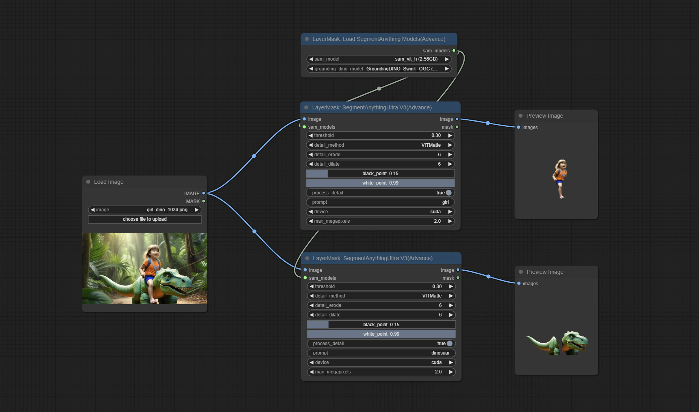  

节点选项说明:
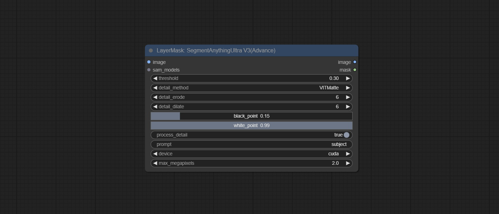
选项与SegmentAnythingUltra节点一致，去掉了sam_model和ground_dino_model改为从节点输入获取。

### <a id="table1">LoadSegmentAnythingModels</a>
加载SegmentAnything模型。
  
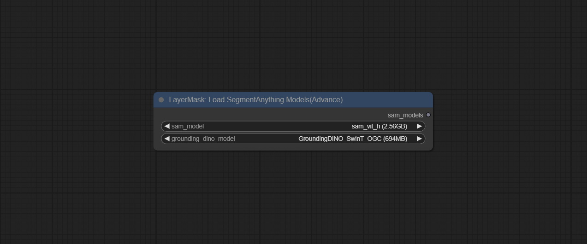


### <a id="table1">SAM2Ultra</a>
本节点是[kijai/ComfyUI-segment-anything-2](https://github.com/kijai/ComfyUI-segment-anything-2)的改造版本。感谢[kijai](https://github.com/kijai)为ComfyUI社区做出的巨大贡献。    
SAM2 Ultra 节点仅支持单张图片，如果需要处理多张图片，请先将image batch 转换为 image list。    
*请从[百度网盘](https://pan.baidu.com/s/1xaQYBA6ktxvAxm310HXweQ?pwd=auki) 或者 [huggingface.co/Kijai/sam2-safetensors](https://huggingface.co/Kijai/sam2-safetensors/tree/main)下载全部模型文件并复制到```ComfyUI/models/sam2```文件夹。

    

节点选项说明:  
    

* image: 图片输入。
* bboxes: 识别框数据输入。
* sam2_model: 选择SAM2模型。
* presicion: 模型精度，可选择fp16, bf16 和 fp32。
* bbox_select: 选择输入的框数据。有3个选项："all"为全部选择，"first"为选择置信度最高的框，"by_index"可以指定框的索引。
* select_index: 当bbox_select为"by_index"时，此选项有效。0为第一张。可以输入多个值，中间用任意非数字字符分隔，包括不仅限于逗号，句号，分号，空格或者字母，甚至中文。
* cache_model: 是否缓存模型。缓存模型后将节省模型加载的时间。
* detail_method: 边缘处理方法。提供了VITMatte, VITMatte(local), PyMatting, GuidedFilter。如果首次使用VITMatte后模型已经下载，之后可以使用VITMatte(local)。
* detail_erode: 遮罩边缘向内侵蚀范围。数值越大，向内修复的范围越大。
* detail_dilate: 遮罩边缘向外扩张范围。数值越大，向外修复的范围越大。
* black_point: 边缘黑色采样阈值。
* white_point: 边缘白色采样阈值。
* process_detail: 此处设为False将跳过边缘处理以节省运行时间。
* device: 设置是否使用cuda。
* max_megapixels: 设置vitmatte运算的最大尺寸。

### <a id="table1">SAM2VideoUltra</a>
SAM2 Video Ultra 节点支持处理多张图片或视频序列帧。请在序列的第一帧定义识别框数据以保证正确识别。

https://github.com/user-attachments/assets/4726b8bf-9b98-4630-8f54-cb7ed7a3d2c5

https://github.com/user-attachments/assets/b2a45c96-4be1-4470-8ceb-addaf301b0cb

节点选项说明:  
    

* image: 图片输入。
* bboxes: 可选输入，识别框数据输入。bboxes 和 first_frame_mask 二者必须输入其中之一。如果有first_frame_mask输入，bboxes将被忽略。
* first_frame_mask: 可选输入遮罩，这里的遮罩将作为首帧识别对象。bboxes 和 first_frame_mask 二者必须输入其中之一。如果有first_frame_mask输入，bboxes将被忽略。
* pre_mask: 可选输入遮罩，这里的遮罩将作为传播关注范围限制，有助于提高识别准确度。
* sam2_model: 选择SAM2模型。
* presicion: 模型精度，可选择fp16, bf16。
* cache_model: 是否缓存模型。缓存模型后将节省模型加载的时间。
* individual_object: 当设置为 True时，将专注于识别单一对象。设置为False时，将尝试为多个对象生成识别框。
* mask_preview_color: 在预览输出中显示非遮罩区域的颜色。
* detail_method: 边缘处理方法。仅VITMatte可用。
* detail_erode: 遮罩边缘向内侵蚀范围。数值越大，向内修复的范围越大。
* detail_dilate: 遮罩边缘向外扩张范围。数值越大，向外修复的范围越大。
* black_point: 边缘黑色采样阈值。
* white_point: 边缘白色采样阈值。
* process_detail: 此处设为False将跳过边缘处理以节省运行时间。
* device: 本节点限制仅使用cuda。
* max_megapixels: 设置vitmatte运算的最大尺寸。更大的尺寸将获得更精细的遮罩边缘，但会导致运算速度明显下降。

### <a id="table1">ObjectDetectorGemini</a>
使用Gemini API进行物体检测。 
请在[Google AI Studio](https://makersuite.google.com/app/apikey)申请你的API key, 并将其填到```api_key.ini```, 这个文件位于插件根目录下, 默认名字是```api_key.ini.example```, 初次使用这个文件需将文件后缀改为.ini。用文本编辑软件打开，在```google_api_key=```后面填入你的API key并保存。
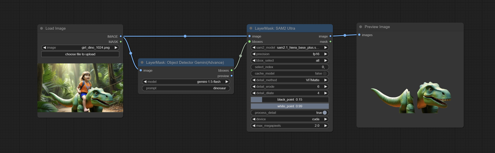

节点选项说明:  
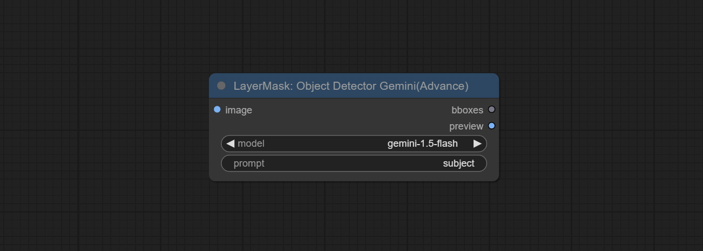    

* image: 图片输入。
* model: Gemini模型。
* prompt: 描述需要识别的对象。


### <a id="table1">ObjectDetectorFL2</a>
使用Florence2模型识别图片中的对象，并输出识别框数据。    
*请从 [百度网盘](https://pan.baidu.com/s/1hzw9-QiU1vB8pMbBgofZIA?pwd=mfl3)下载模型文件并复制到```ComfyUI/models/florence2```文件夹。

节点选项说明:  
    

* image: 图片输入。
* florence2_model: Florence2模型。从[Florence2模型加载器](#LoadFlorence2Model)输入。
* prompt: 描述需要识别的对象。
* sort_method: 选择框排序方法， 有4个选项："left_to_right"为从左到右排序，"top_to_bottom"为从上到下排序，"big_to_small"为从大到小排序，"confidence"为按置信度排序。
* bbox_select: 选择输入的框数据。有3个选项："all"为全部选择，"first"为选择置信度最高的框，"by_index"可以指定框的索引。
* select_index: 当bbox_select为"by_index"时，此选项有效。0为第一张。可以输入多个值，中间用任意非数字字符分隔，包括不仅限于逗号，句号，分号，空格或者字母，甚至中文。

### <a id="table1">ObjectDetectorYOLOWorld</a> (已废弃，如继续使用需要手动安装依赖包)

由于依赖包安装易出问题，已废弃此节点。如需使用，请手动安装下列依赖包：
```
pip install inference-cli>=0.13.0
pip install inference-gpu[yolo-world]>=0.13.0
```

使用YOLO World模型识别图片中的对象，并输出识别框数据。    
*请从 [百度网盘](https://pan.baidu.com/s/1QpjajeTA37vEAU2OQnbDcQ?pwd=nqsk) 或[GoogleDrive](https://drive.google.com/drive/folders/1nrsfq4S-yk9ewJgwrhXAoNVqIFLZ1at7?usp=sharing)下载模型文件并复制到```ComfyUI/models/yolo-world```文件夹。


节点选项说明:  
    

* image: 图片输入。
* confidence_threshold: 置信度阈值。
* nms_iou_threshold: 非极大值抑制阈值。
* prompt: 描述需要识别的对象。
* sort_method: 选择框排序方法， 有4个选项："left_to_right"为从左到右排序，"top_to_bottom"为从上到下排序，"big_to_small"为从大到小排序，"confidence"为按置信度排序。
* bbox_select: 选择输入的框数据。有3个选项："all"为全部选择，"first"为选择置信度最高的框，"by_index"可以指定框的索引。
* select_index: 当bbox_select为"by_index"时，此选项有效。0为第一张。可以输入多个值，中间用任意非数字字符分隔，包括不仅限于逗号，句号，分号，空格或者字母，甚至中文。

### <a id="table1">ObjectDetectorYOLO8</a>
使用YOLO 8模型识别图片中的对象，并输出识别框数据。   
*请在 [GoogleDrive](https://drive.google.com/drive/folders/1I5TISO2G1ArSkKJu1O9b4Uvj3DVgn5d2) 或者 [百度网盘](https://pan.baidu.com/s/1pEY6sjABQaPs6QtpK0q6XA?pwd=grqe) 下载模型文件并放到 ```ComfyUI/models/yolo``` 文件夹。

节点选项说明:  

* image: 图片输入。
* yolo_model: 选择yolo模型。
* sort_method: 选择框排序方法， 有4个选项："left_to_right"为从左到右排序，"top_to_bottom"为从上到下排序，"big_to_small"为从大到小排序，"confidence"为按置信度排序。
* bbox_select: 选择输入的框数据。有3个选项："all"为全部选择，"first"为选择置信度最高的框，"by_index"可以指定框的索引。
* select_index: 当bbox_select为"by_index"时，此选项有效。0为第一张。可以输入多个值，中间用任意非数字字符分隔，包括不仅限于逗号，句号，分号，空格或者字母，甚至中文。

### <a id="table1">ObjectDetectorMask</a>
使用遮罩作为识别框数据。遮罩上所有被白色区域包围的区域，将被识别为一个对象。多个封闭区域将各自识别。   

节点选项说明:  

* object_mask: 遮罩输入。
* sort_method: 选择框排序方法， 有4个选项："left_to_right"为从左到右排序，"top_to_bottom"为从上到下排序，"big_to_small"为从大到小排序，"confidence"为默认排序。
* bbox_select: 选择输入的框数据。有3个选项："all"为全部选择，"first"为选择置信度最高的框，"by_index"可以指定框的索引。
* select_index: 当bbox_select为"by_index"时，此选项有效。0为第一张。可以输入多个值，中间用任意非数字字符分隔，包括不仅限于逗号，句号，分号，空格或者字母，甚至中文。

### <a id="table1">BBoxJoin</a>
合并识别框数据。   

节点选项说明:  

* bboxes_1: 必选输入。第一组识别框。
* bboxes_2: 可选输入。第二组识别框。
* bboxes_3: 可选输入。第三组识别框。
* bboxes_4: 可选输入。第四组识别框。

### <a id="table1">DrawBBoxMask</a>
将ObjectDetector节点输出的识别框数据绘制为遮罩。   


节点选项说明:  

* image: 图片输入。必须与ObjectDetector节点识别的图片一致。
* bboxes: 识别框数据输入。
* grow_top: 每个识别框向上扩展范围，为识别框高度的百分比。正值为向上扩展，负值为向下扩展。
* grow_bottom: 每个识别框向下扩展范围，为识别框高度的百分比，正值为向下扩展，负值为向上扩展。
* grow_left: 每个识别框向左扩展范围，为识别框宽度的百分比。正值为向左扩展，负值为向右扩展。
* grow_right: 每个识别框向右扩展范围，为识别框宽度的百分比。正值为向右扩展，负值为向左扩展。

### <a id="table1">DrawBBoxMaskV2</a>
在[DrawBBoxMask](#DrawBBoxMask) 节点基础上增加圆角矩形绘制。   
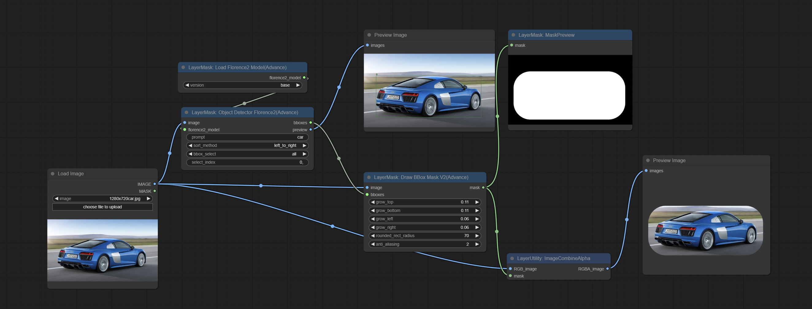

新增选项:  
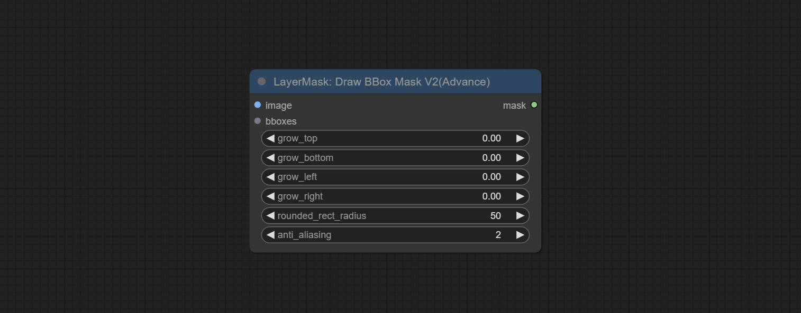
* rounded_rect_radius: 圆角矩形半径，范围0-100，数值越大圆角半径越大。
* anti_alias: 抗锯齿，范围从0-16，数值越大，锯齿越不明显。过高的数值将显著降低节点的处理速度。


### <a id="table1">EVF-SAMUltra</a>
本节点是[EVF-SAM](https://github.com/hustvl/EVF-SAM)在ComfyUI中的实现。    
*请从[百度网盘](https://pan.baidu.com/s/1EvaxgKcCxUpMbYKzLnEx9w?pwd=69bn) 或者 [huggingface/EVF-SAM2](https://huggingface.co/YxZhang/evf-sam2/tree/main), [huggingface/EVF-SAM](https://huggingface.co/YxZhang/evf-sam/tree/main) 下载全部模型文件并复制到```ComfyUI/models/EVF-SAM```文件夹(请将模型保存在各自子目录中)。

    

节点选项说明:  
    

* image: 图片输入。
* model: 选择模型。目前有 evf-sam2 和 evf-sam 可选。
* presicion: 模型精度，可选择fp16, bf16 和 fp32。
* load_in_bit: 按位精度加载模型。可选择full, 8 和 4。
* pormpt: 用于分割的提示词。
* detail_method: 边缘处理方法。提供了VITMatte, VITMatte(local), PyMatting, GuidedFilter。如果首次使用VITMatte后模型已经下载，之后可以使用VITMatte(local)。
* detail_erode: 遮罩边缘向内侵蚀范围。数值越大，向内修复的范围越大。
* detail_dilate: 遮罩边缘向外扩张范围。数值越大，向外修复的范围越大。
* black_point: 边缘黑色采样阈值。
* white_point: 边缘白色采样阈值。
* process_detail: 此处设为False将跳过边缘处理以节省运行时间。
* device: 设置是否使用cuda。
* max_megapixels: 设置vitmatte运算的最大尺寸。


### <a id="table1">Florence2Ultra</a>
使用 Florence2 模型的分割功能，同时具有超高的边缘细节。
本节点部分的代码来自[spacepxl/ComfyUI-Florence-2](https://github.com/spacepxl/ComfyUI-Florence-2)，感谢原作者。
*请从 [百度网盘](https://pan.baidu.com/s/1hzw9-QiU1vB8pMbBgofZIA?pwd=mfl3)下载模型文件并复制到```ComfyUI/models/florence2```文件夹。

    

节点选项说明:  
    
* florence2_model: Florence2模型输入。
* image: 图片输入。
* task: 选择florence2任务。
* text_input: florence2任务文本输入。
* detail_method: 边缘处理方法。提供了VITMatte, VITMatte(local), PyMatting, GuidedFilter。如果首次使用VITMatte后模型已经下载，之后可以使用VITMatte(local)。
* detail_erode: 遮罩边缘向内侵蚀范围。数值越大，向内修复的范围越大。
* detail_dilate: 遮罩边缘向外扩张范围。数值越大，向外修复的范围越大。
* black_point: 边缘黑色采样阈值。
* white_point: 边缘白色采样阈值。
* process_detail: 此处设为False将跳过边缘处理以节省运行时间。
* device: 设置是否使用cuda。
* max_megapixels: 设置vitmatte运算的最大尺寸。

### <a id="table1">LoadFlorence2Model</a>
Florence2 模型加载器。
   
目前有 base, base-ft, large, large-ft, DocVQA, SD3-Captioner 和 base-PromptGen模型可以选择。


### <a id="table1">BiRefNetUltra</a>
使用BiRefNet模型去除背景，有更好的识别能力，同时具有超高的边缘细节。
本节点模型部分的代码来自vipery的[ComfyUI-BiRefNet](https://github.com/viperyl/ComfyUI-BiRefNet)，感谢原作者。

*从[https://huggingface.co/ViperYX/BiRefNet](https://huggingface.co/ViperYX/BiRefNet/tree/main) 或者 [百度网盘](https://pan.baidu.com/s/1GxtuNDTIHkuu4FR4uGAT-g?pwd=t2cf) 下载```BiRefNet-ep480.pth```,```pvt_v2_b2.pth```,```pvt_v2_b5.pth```,```swin_base_patch4_window12_384_22kto1k.pth```, ```swin_large_patch4_window12_384_22kto1k.pth```5个文件至```ComfyUI/models/BiRefNet```文件夹。

    

节点选项说明:  
    
* detail_method: 边缘处理方法。提供了VITMatte, VITMatte(local), PyMatting, GuidedFilter。如果首次使用VITMatte后模型已经下载，之后可以使用VITMatte(local)。
* detail_erode: 遮罩边缘向内侵蚀范围。数值越大，向内修复的范围越大。
* detail_dilate: 遮罩边缘向外扩张范围。数值越大，向外修复的范围越大。
* black_point: 边缘黑色采样阈值。
* white_point: 边缘白色采样阈值。
* process_detail: 此处设为False将跳过边缘处理以节省运行时间。
* device: 设置是否使用cuda。
* max_megapixels: 设置vitmatte运算的最大尺寸。


### <a id="table1">BiRefNetUltraV2</a>
本节点支持使用最新的BiRefNet模型。    
*从[百度网盘](https://pan.baidu.com/s/12z3qUuqag3nqpN2NJ5pSzg?pwd=ek65) 或 [GoogleDrive](https://drive.google.com/drive/folders/1s2Xe0cjq-2ctnJBR24563yMSCOu4CcxM) 下载 ```BiRefNet-general-epoch_244.pth``` 到 ```ComfyUI/Models/BiRefNet/pth``` 文件夹。也可以下载更多的BiRefNet模型放到这里。

    

节点选项说明:  
  

* image: 图片输入。
* birefnet_model: BiRefNet模型输入，模型从LoadBiRefNetModel节点输出。
* detail_method: 边缘处理方法。提供了VITMatte, VITMatte(local), PyMatting, GuidedFilter。如果首次使用VITMatte后模型已经下载，之后可以使用VITMatte(local)。
* detail_erode: 遮罩边缘向内侵蚀范围。数值越大，向内修复的范围越大。
* detail_dilate: 遮罩边缘向外扩张范围。数值越大，向外修复的范围越大。
* black_point: 边缘黑色采样阈值。
* white_point: 边缘白色采样阈值。
* process_detail: 由于BiRefNet的边缘处理已经非常不错，此处默认设为False。
* device: 设置是否使用cuda。
* max_megapixels: 设置vitmatte运算的最大尺寸。


### <a id="table1">LoadBiRefNetModel</a>
加载BiRefNet模型。 


节点选项说明:  
  

* model: 选择模型。列出 ```CoomfyUI/models/BiRefNet/pth``` 文件夹下的文件供选择。

### <a id="table1">LoadBiRefNetModelV2</a>
本节点是[jimlee2048](https://github.com/jimlee2048)提交的PR，支持加载RMBG-2.0模型。    
从 [huggingface](https://huggingface.co/briaai/RMBG-2.0/tree/main) 或 [百度网盘](https://pan.baidu.com/s/1viIXlZnpTYTKkm2F-QMj_w?pwd=axr9) 下载全部文件并复制到```ComfyUI/models/BiRefNet/RMBG-2.0```文件夹。

节点选项说明:  
  

* model: 选择模型。有两个选项： ```BiRefNet-General``` 和 ```RMBG-2.0```。


### <a id="table1">TransparentBackgroundUltra</a>
使用transparent-background模型去除背景，有更好的识别能力和识别速度，同时具有超高的边缘细节。

*从 [googledrive](https://drive.google.com/drive/folders/10KBDY19egb8qEQBv34cqIVSwd38bUAa9?usp=sharing) 或 [百度网盘](https://pan.baidu.com/s/10JO0uKzTxJaIkhN_J7RSyw?pwd=v0b0) 下载全部文件至```ComfyUI/models/transparent-background```文件夹。

    

节点选项说明:  
    
* model: 选择模型。
* detail_method: 边缘处理方法。提供了VITMatte, VITMatte(local), PyMatting, GuidedFilter。如果首次使用VITMatte后模型已经下载，之后可以使用VITMatte(local)。
* detail_erode: 遮罩边缘向内侵蚀范围。数值越大，向内修复的范围越大。
* detail_dilate: 遮罩边缘向外扩张范围。数值越大，向外修复的范围越大。
* black_point: 边缘黑色采样阈值。
* white_point: 边缘白色采样阈值。
* process_detail: 此处设为False将跳过边缘处理以节省运行时间。
* device: 设置是否使用cuda。
* max_megapixels: 设置vitmatte运算的最大尺寸。

### <a id="table1">PersonMaskUltra</a>
为人物生成脸、头发、身体皮肤、衣服或配饰的遮罩。与之前的A Person Mask Generator节点相比，这个节点具有超高的边缘细节。
本节点的模型代码来自[a-person-mask-generator](https://github.com/djbielejeski/a-person-mask-generator)，边缘处理代码来自spacepxl的[ComfyUI-Image-Filters](https://github.com/spacepxl/ComfyUI-Image-Filters)，感谢原作者。
*从[百度网盘](https://pan.baidu.com/s/13zqZtBt89ueCyFufzUlcDg?pwd=jh5g) 下载模型文件并放到```ComfyUI/models/mediapipe```文件夹。

    

节点选项说明:  
    
* face: 脸部识别。
* hair: 头发识别。
* body: 身体皮肤识别。
* clothes: 衣服识别。
* accessories: 配饰(例如背包)识别。
* background: 背景识别。
* confidence: 识别阈值，更低的值将输出更多的遮罩范围。
* detail_range: 边缘细节范围。
* black_point: 边缘黑色采样阈值。
* white_point: 边缘白色采样阈值。
* process_detail: 此处设为False将跳过边缘处理以节省运行时间。

### <a id="table1">PersonMaskUltraV2</a>
PersonMaskUltra的V2升级版，增加了VITMatte边缘处理方法。

在PersonMaskUltra的基础上做了如下改变:  
    
* detail_method: 边缘处理方法。提供了VITMatte, VITMatte(local), PyMatting, GuidedFilter。如果首次使用VITMatte后模型已经下载，之后可以使用VITMatte(local)。
* detail_erode: 遮罩边缘向内侵蚀范围。数值越大，向内修复的范围越大。
* detail_dilate: 遮罩边缘向外扩张范围。数值越大，向外修复的范围越大。
* device: 设置是否使用cuda。
* max_megapixels: 设置vitmatte运算的最大尺寸。


### <a id="table1">HumanPartsUltra</a>
用于分割人体肢体，是基于[metal3d/ComfyUI_Human_Parts](https://github.com/metal3d/ComfyUI_Human_Parts) 的重新封装，感谢原作者。
本节点在原作基础上增加了超精细边缘处理。请从[百度网盘](https://pan.baidu.com/s/1-6uwH6RB0FhIVfa3qO7hhQ?pwd=d862) 或 [huggingface](https://huggingface.co/Metal3d/deeplabv3p-resnet50-human/tree/main) 下载模型文件并复制到 ```ComfyUI\models\onnx\human-parts``` 文件夹。
    

节点选项说明:  
    

* image: 图片输入。
* face: 是否识别人脸。
* hair: 是否识别头发。
* galsses: 是否识别眼镜。
* top_clothes: 是否识别上装。
* bottom_clothes: 是否识别下装。
* torso_skin: 是否识别躯干皮肤。
* left_arm: 是否识别左手臂。
* right_arm: 是否识别右手臂。
* left_leg: 是否识别左腿。
* right_leg: 是否识别右腿。
* left_foot: 是否识别左脚。
* right_foot: 是否识别右脚。
* detail_method: 边缘处理方法。提供了VITMatte, VITMatte(local), PyMatting, GuidedFilter。如果首次使用VITMatte后模型已经下载，之后可以使用VITMatte(local)。
* detail_erode: 遮罩边缘向内侵蚀范围。数值越大，向内修复的范围越大。
* detail_dilate: 遮罩边缘向外扩张范围。数值越大，向外修复的范围越大。
* black_point: 边缘黑色采样阈值。
* white_point: 边缘白色采样阈值。
* process_detail: 此处设为False将跳过边缘处理以节省运行时间。
* device: 设置是否使用cuda。
* max_megapixels: 设置vitmatte运算的最大尺寸。


### <a id="table1">YoloV8Detect</a>
使用YoloV8模型检测人脸、手部box区域，或者人物分割。支持输出所选择数量的通道。
请在 [GoogleDrive](https://drive.google.com/drive/folders/1I5TISO2G1ArSkKJu1O9b4Uvj3DVgn5d2) 或者 [百度网盘](https://pan.baidu.com/s/1pEY6sjABQaPs6QtpK0q6XA?pwd=grqe) 下载模型文件并放到 ```ComfyUI/models/yolo``` 文件夹。

    

节点选项说明:  
    
* yolo_model: yolo模型选择。带有```seg```名字的模型可以输出分割的mask, 否则只能输出box区域的遮罩。
* mask_merge: 选择合并的遮罩。```all```是合并全部遮罩输出。选数值是输出多少个遮罩，按识别置信度排序合并输出。

输出:
* mask: 输出的遮罩。
* yolo_plot_image: yolo识别结果预览图。
* yolo_masks: yolo识别出来的所有遮罩，每个单独的遮罩输出为一个mask。


### <a id="table1">MediapipeFacialSegment</a>
使用Mediapipe模型检测人脸五官，分割左右眉、眼睛、嘴唇和牙齿。
*从[百度网盘](https://pan.baidu.com/s/13zqZtBt89ueCyFufzUlcDg?pwd=jh5g) 下载模型文件并放到```ComfyUI/models/mediapipe```文件夹。

    

节点选项说明:  
    
* left_eye: 左眼识别开关。
* left_eyebrow: 左眉识别开关。
* right_eye: 右眼识别开关。
* right_eyebrow: 右眉识别开关。
* lips: 嘴唇识别开关。
* tooth: 牙齿识别开关。


### <a id="table1">MaskByDifferent</a>
计算两张图像不同之处，并输出为遮罩。
    

节点选项说明:  
    
* gain: 计算增益。调高此值，微弱的差异将更显著的呈现。
* fix_gap: 修补遮罩内部缝隙。更高的值将修补更大的缝隙。
* fix_threshold: 修补阈值。
* main_subject_detect: 此项设为True将开启主体侦测，忽略主体之外的差异。


## <a id="table1">节点注解</a>
<sup>1</sup>  image、mask和background_image(如果有输入)这三项必须是相同的尺寸。    

<sup>2</sup>  mask不是必须的输入项，默认使用image的alpha通道，如果image输入不包含alpha通道将自动创建整个图像的alpha通道。如果输入mask，原本的alpha通道将被mask覆盖。    

<sup>3</sup>   <a id="table1">混合模式</a> 包括normal、multply、screen、add、subtract、difference、darker、lighter、color_burn、color_dodge、linear_burn、linear_dodge、overlay、soft_light、hard_light、vivid_light、pin_light、linear_light、hard_mix, 共19种混合模式。    
    
<font size="1">*混合模式预览</font><br />     


<sup>3</sup>   <a id="table1">混合模式V2</a>  包括nomal, dissolve, darken, multiply, color burn, linear burn, darker color, lighten, screen, color dodge, linear dodge(add), lighter color, dodge, overlay, soft light, hard light, vivid light, linear light, pin light, hard mix, difference, exclusion, subtract, divide, hue, saturation, color, luminosity, grain extract, grain merge共30种模式。    
混合模式V2的部分代码来自[Virtuoso Nodes for ComfyUI](https://github.com/chrisfreilich/virtuoso-nodes)的```Blend Modes```节点。感谢原作者。
    
<font size="1">*混合模式V2版预览</font><br />     

<sup>4</sup>  颜色使用16进制RGB字符串格式描述，例如 '#FA3D86'。    

<sup>5</sup>  image和mask这两项必须是相同的尺寸。    

## Star 记录 

[](https://star-history.com/#chflame163/ComfyUI_LayerStyle_Advance&Date)

##  声明
LayerStyle Advance节点遵照MIT开源协议，有部分功能代码和模型来自其他开源项目，感谢原作者。如果作为商业用途，请查阅原项目授权协议使用。
